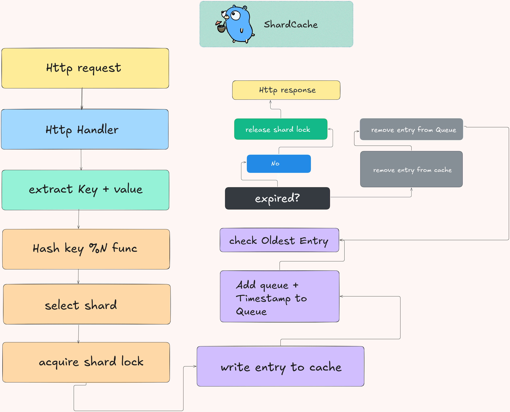

#### notes 
resource : https://blog.allegro.tech/2016/03/writing-fast-cache-service-in-go.html#why-go

#### requirements (on their implementation)

- the service should handle 10k requests per second (5k reads , 5k writes)
- the cache entries should be for 10 minutes at minimum.
- have responses time should be in avg of 5ms (99th percentile should be under 10ms)
- the post requests should be handled they need to be able to handle json , max size of payload should be 500kb with , the entry to cache need to be like `{key:value`}
- fetch an entry and return int via a GET request immediately after the entry was added via a POST request 

#### working of the cache should have be like
- be very fast even with millions of entries
- provide concurrent access (fetching without blocking or enforcing a certain order i.e; in most cases multiple goroutines can access the cache at the same time safely.)
- automatically remove/delete cached data after a fixed amount of time.

#### looking at concurrency 

Concurrency is when the program is dealing with a number of tasks at once. This means the program is trying to manage tasks in a given period of time. But in Concurrency there will be only one task in execution, Not all tasks will run at the same time. Once a running task ends or comes into the waiting stage, a New task will be taken up and executed. This improves our application execution speeds as compared to traditional single-thread applications.

#### dealing with concurrency

- now in this case we need to deal with concurrency , our service will recieve many requests concurrently and we need to provide concurrent access to the cache , now to ensure  that only one goroutine is modifying the cache at a time we will use a sync.RWMutex to protect the cache, but then other go routines wont be able to modify the cache at the same time which will create a bottleneck and waste resources .

##### implementation of shards to get over the bottleneck
The flow is:

Create N shards, each with its own map and lock.
Hash the key to determine which shard owns it:
shardIndex = hash(key) % N
Acquire only that shard's lock.
Read/write the key in that shard.
Release the lock.

#### Eviction flow

- A new entry is added to the cache.
- Store its key + creation timestamp in the FIFO queue.
- During the next cache write, check the oldest queue entry.
- Compare its creation time with the current time.
- If it has exceeded the TTL, remove it from both the queue and cache.
- Keep checking the next oldest entry until the oldest one hasn't expired.
- Eviction happens during writes because the cache lock is already acquired.

### Flow
`key → hash → shard → lock → write → FIFO → check expiry → evict expired entries → unlock.`

### Diagram

