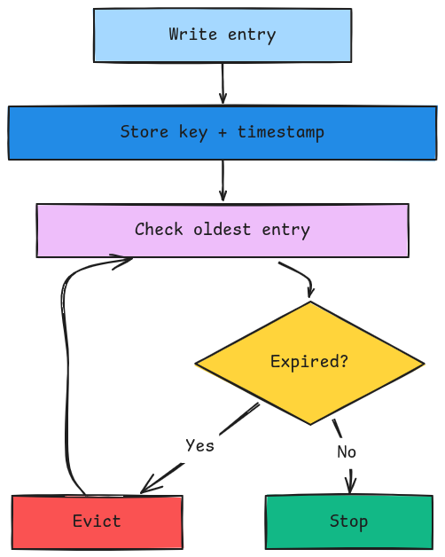

# ShardCache

A concurrent, sharded in-memory cache written in Go.

ShardCache is designed to handle high concurrent read/write traffic while keeping lock contention low. The cache is split into multiple shards, with each shard maintaining its own map and lock.

## what it does

* 10k requests/sec target

  * 5k reads/sec
  * 5k writes/sec
* Minimum 10 minute TTL
* Average response time under 5ms
* 99th percentile latency under 10ms
* JSON POST payloads up to 500KB
* Cache entries follow a `key:value` structure
* A newly written entry must be immediately available through GET

## Architecture

Instead of protecting the entire cache with a single lock, ShardCache distributes entries across multiple shards.

```text
key
 |
hash(key)
 |
shardIndex = hash % N
 |
shard
 |
lock
 |
read/write
 |
unlock
```

Each shard has:

* its own map
* its own `sync.RWMutex`
* its own eviction queue

This allows different goroutines to operate on different shards concurrently.

## Eviction

Entries have a fixed TTL and are removed using a FIFO queue.



Eviction is performed during writes while the shard lock is already held.

When an existing key is overwritten, its value and timestamp are updated so the new entry gets a fresh TTL.

## Request flow

```text
key → hash → shard → lock → write → FIFO → check expiry → evict expired entries → unlock
```

## Project notes

For the detailed reasoning behind the requirements, concurrency model, sharding, and eviction strategy, see [notes.md](./notes.md).


